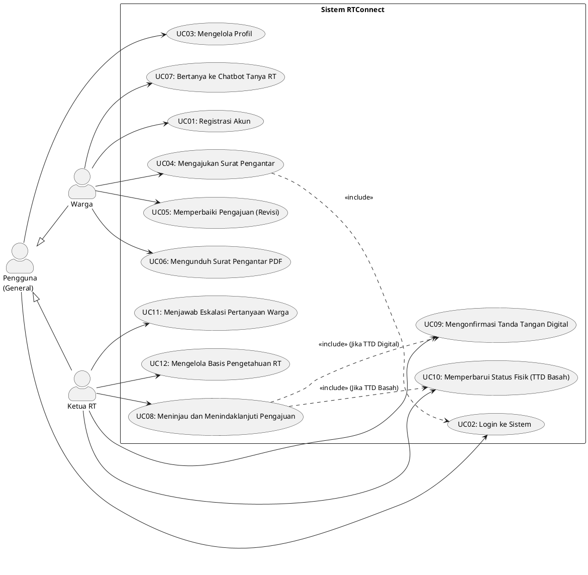

# DOKUMEN REVISI DAN PENYEMPURNAAN LAPORAN RTCONNECT
**Mata Kuliah:** Praktikum Pembangunan Perangkat Lunak (Kelas I1)  
**Dosen Pengampu:** Dr. Indra Kharisma Raharjana, S.Kom., M.T.  
**Kelompok 3:**
1. Muhammad Nafidz Arradhin (187241027)
2. Mirza Diwa Luscakson (187241042)
3. Febrian Muhammad Yudhistira (187241051)
4. Ahmad Dhafin Al Farisy (187241057)

---

## DAFTAR ISI REVISI
1. [Ringkasan Eksekutif Hasil Audit Laporan](#ringkasan-eksekutif-hasil-audit-laporan)
2. [Matriks Inkonsistensi Fatal Antar-Bab & Solusinya](#matriks-inkonsistensi-fatal-antar-bab--solusinya)
3. [Naskah Revisi Bab I: Pendahuluan](#naskah-revisi-bab-i-pendahuluan)
4. [Naskah Revisi Bab II: BPMN (AS-IS & TO-BE)](#naskah-revisi-bab-ii-bpmn-as-is--to-be)
5. [Naskah Revisi Bab III: Use Case Diagram & Spesifikasi](#naskah-revisi-bab-iii-use-case-diagram--spesifikasi)
6. [Naskah Revisi Bab IV: User Interface Low Fidelity & Koreksi Penomoran](#naskah-revisi-bab-iv-user-interface-low-fidelity--koreksi-penomoran)
7. [Naskah Revisi Bab V: Data Model (CDM/PDM) & Sinkronisasi Arsitektur](#naskah-revisi-bab-v-data-model-cdmpdm--sinkronisasi-arsitektur)
8. [Naskah Revisi Bab VI: User Story & BDD Gherkin Scenarios](#naskah-revisi-bab-vi-user-story--bdd-gherkin-scenarios)
9. [Naskah Revisi Bab VII & VIII: Activity & Sequence Diagram](#naskah-revisi-bab-vii--viii-activity--sequence-diagram)
10. [Daftar Pustaka Lengkap & Terstandarisasi (APA 7th Edition)](#daftar-pustaka-lengkap--terstandarisasi-apa-7th-edition)

---

## 1. RINGKASAN EKSEKUTIF HASIL AUDIT LAPORAN

Laporan praktikum *RTConnect: Perangkat Lunak Administrasi di Tingkat RT/RW dengan Integrasi NLP dan Generative AI* memiliki ide solusi yang sangat relevan, inovatif, dan memenuhi standar proyek tingkat perguruan tinggi. Namun, setelah dilakukan penelaahan mendalam terhadap ke-59 halaman dokumen, ditemukan beberapa inkonsistensi krusial, kesalahan semantik diagram UML, ambiguitas data model, dan kekeliruan tata bahasa/editorial yang berpotensi menjadi sasaran kritik tajam oleh dosen pengampu/penguji (Dr. Indra Kharisma Raharjana).

### 7 Temuan Paling Kritis (Red Flags):
1. **Kesalahan Pembuka Bab VI (Hal. 42):**
   Tertulis: *"Pada Bab I ini, peta interaksi tersebut diturunkan menjadi dua komponen utama: User Story dan User Story Scenario..."*. Ini adalah kekeliruan fatal salah tulis/copy-paste, seharusnya **"Pada Bab VI ini..."**.
2. **Kontradiksi Proses AS-IS (Hal. 11 vs Hal. 7):**
   Di Bab 2.1.1 (hal. 11), AS-IS menyebutkan warga mengisi form di *"aplikasi Sayang Warga"*, sedangkan di Bab I (hal. 7) ditegaskan bahwa administrasi RT/RW saat ini menghadapi kendala *"penggunaan proses manual"* dan *"human error"*. Jika sudah ada aplikasi digital Sayang Warga, urgensi pembuatan RTConnect menjadi rancu kecuali didefinisikan secara tegas batasan dan celah (gap) dari sistem lama tersebut.
3. **Hilangnya Fitur Autentikasi di Use Case Diagram (Hal. 15):**
   Bab III (Use Case) **tidak memuat** use case "Login" dan "Registrasi Akun", tetapi di Bab IV (UI), Bab VII (Activity Diagram 7.1 & 7.2), dan Bab VIII (Sequence Diagram 8.1 & 8.2) kedua fitur ini menjadi diagram pembuka. Ini melanggar prinsip *traceability* perangkat lunak.
4. **Kekeliruan Semantik Relasi Use Case `<<extend>>` (Hal. 15-16):**
   Meninjau Pengajuan Surat dihubungkan dengan relasi `<<extend>>` dari Menindaklanjuti Pengajuan Surat dengan narasi "peninjauan bersifat opsional". Dalam proses nyata, peninjauan berkas adalah **prasyarat wajib** (`<<include>>`), bukan opsi tambahan.
5. **Aksi Fisik Luar Sistem Dimodelkan Sebagai Use Case Sistem (Hal. 15, 24):**
   Use case "Menandatangani Surat Secara Basah" adalah aktivitas fisik di meja ketua RT menggunakan pena. Sistem tidak bisa menandatangani kertas secara basah. Use case sistem yang benar adalah **"Mengonfirmasi Pengambilan Fisik / Status TTD Basah"** atau **"Mencetak Berkas Pengajuan"**.
6. **Inkonsistensi Daftar Isi vs Halaman Bab IV (Hal. 4, 31, 35):**
   - Sub-bab 4.7 ("Page Formulir Pengajuan Warga") hilang dari Daftar Isi (dari 4.6 langsung loncat ke 4.8).
   - Pada Halaman 31 (4.3 Login Page), caption gambar salah tertulis *"Gambar 4.4 Home Page"*, menimbulkan duplikasi dengan Halaman 32 yang juga berjudul *"Gambar 4.4 Home Page"*.
7. **Ketidaksinkronan Arsitektur Database (CDM/PDM) dengan Sequence Diagram Login:**
   Di PDM terdapat dua tabel pengguna yang terpisah secara fisik (`RT` dan `Warga`), tetapi pada Sequence Diagram Login (hal. 54), entitas yang dipanggil adalah `:Akun` secara tunggal dengan pemindaian `findUser(email/nik)` dan pengecekan peran dinamis. Hal ini menyebabkan inkonsistensi implementasi query basis data.

---

## 2. MATRIKS INKONSISTENSI FATAL ANTAR-BAB & SOLUSINYA

| No | Lokasi Temuan | Kondisi Saat Ini (As-Is Document) | Masalah / Dampak Akademik | Rekomendasi Solusi Perbaikan (To-Be) |
|---|---|---|---|---|
| 1 | Hal. 42 (Bab VI) | Kalimat: *"Pada Bab I ini, peta interaksi tersebut diturunkan..."* | Menurunkan kredibilitas penyusunan laporan di mata dosen. | Ubah menjadi: *"Pada Bab VI ini, peta kebutuhan dan interaksi pengguna..."* |
| 2 | Hal. 11 (BPMN AS-IS) & Hal. 7 (Latar Belakang) | Muncul aplikasi "Sayang Warga" tanpa penjelasan kontekstual pembeda dengan RTConnect. | Dosen akan bertanya: *"Kalau sudah ada Sayang Warga, kenapa buat RTConnect?"* | Klarifikasi bahwa "Sayang Warga" adalah sistem informasi kota terpusat yang belum mengakomodasi otomasi Generative AI lokal, ketiadaan chatbot 24/7 di tingkat rukun tetangga, dan masih memerlukan verifikasi manual berulang. |
| 3 | Hal. 15 (Bab III) vs Hal. 47, 49, 53, 54 | Use case Registrasi dan Login tidak ada di Use Case Diagram, padahal ada di UI, Activity, dan Sequence Diagram. | Pelanggaran konsistensi UML (*Requirement Traceability Gap*). | Tambahkan use case "Registrasi Akun" dan "Login ke Sistem" ke dalam diagram Bab III dengan generalisasi peran Pengguna (Warga & Ketua RT). |
| 4 | Hal. 15-16 (Bab III) | `Menindaklanjuti Pengajuan Surat ..> Meninjau Pengajuan Surat : <<extend>>` | Salah semantik UML. Peninjauan adalah tahapan yang harus dilalui sebelum pengambilan keputusan. | Ubah relasi menjadi `<<include>>`, atau lebur menjadi satu use case komprehensif: *"Meninjau dan Menindaklanjuti Pengajuan Surat"* dengan extension points keputusan (Setuju, Revisi, Tolak). |
| 5 | Hal. 15, 24-25 | Use Case: *"Menandatangani surat secara basah"*. | Sistem software tidak bisa membubuhkan tinta fisik ke kertas warga. | Ubah nama use case sistem menjadi: *"Memvalidasi Pengambilan Surat Fisik (TTD Basah)"* atau *"Mencetak Draf Surat Pengantar"*. |
| 6 | Hal. 4 & Hal. 31, 35 | Daftar Isi kehilangan sub-bab 4.7; Gambar 4.3 tertulis *"Gambar 4.4 Home Page"*. | Kesalahan tata letak dan penomoran dokumen resmi. | Perbaiki penomoran gambar: Gambar 4.3 Login Page, Gambar 4.4 Home Page, serta masukkan sub-bab 4.7 ke Daftar Isi. |
| 7 | Hal. 39-41 (Bab V) vs Hal. 54-55 (Bab VIII) | Tabel basis data terpisah `RT` dan `Warga`, sedangkan Sequence Diagram memanggil objek tunggal `:Akun`. | Query login menjadi rancu: sistem harus menebak mengecek tabel Warga dulu atau RT dulu. | Gunakan tabel terpusat `users` / `akun` dengan kolom `role` (`'warga'`, `'rt'`), lalu tabel profil spesifik (`warga_profile`, `rt_profile`) jika dibutuhkan atribut tambahan. |
| 8 | Hal. 10 (Batasan AI) vs Hal. 40, 56 | Batasan masalah hanya menyebut "OpenAI API dan FAQ", sementara CDM/Sequence Diagram sudah memakai Vector Embedding, Cosine Similarity, dan KnowledgeBase Chunking (RAG). | Meremehkan inovasi teknis sendiri (*under-promoted*). | Perjelas bahwa Chatbot RTConnect menerapkan arsitektur **Retrieval-Augmented Generation (RAG)** untuk mencegah halusinasi informasi. |
| 9 | Hal. 59 (Daftar Pustaka) | Hanya 4 referensi. | Kurang memadai untuk laporan praktikum rekayasa perangkat lunak semester 5. | Perkaya hingga minimal 15 referensi terkini (RAG, IEEE software engineering, UU ITE Tanda Tangan Elektronik, System Usability Scale). |

---

## 3. NASKAH REVISI BAB I: PENDAHULUAN

### 1.1 Latar Belakang (Revisi Diperkaya & Akademis)
Pelayanan publik pada tingkat akar rumput, khususnya Rukun Tetangga (RT) dan Rukun Warga (RW), merupakan garda terdepan administrasi kependudukan di Indonesia (Agusman et al., 2023). Pengurus RT/RW memiliki peran krusial dalam memvalidasi domisili warganya serta menerbitkan surat pengantar untuk berbagai keperluan birokrasi lanjutan, seperti pengurusan Kartu Tanda Penduduk (KTP), Kartu Keluarga (KK), Surat Keterangan Tidak Mampu (SKTM), hingga perizinan usaha mikro (Arafat et al., 2025). Kendati memegang peranan strategis, pengurus RT/RW umumnya bekerja secara sukarela di luar jam kerja utama mereka, dengan ketersediaan infrastruktur teknologi dan sumber daya manusia yang sangat terbatas.

Berdasarkan observasi pada lingkungan rukun tetangga, proses pelayanan administrasi masih menghadapi kendala klasik:
1. **Ketergantungan Kehadiran Fisik:** Warga yang membutuhkan surat pengantar kerap harus mendatangi kediaman Ketua RT secara tatap muka, yang sering kali terhambat akibat kesibukan atau mobilitas Ketua RT di luar lingkungan.
2. **Keterlambatan dan Kesalahan Administratif (Human Error):** Proses penulisan draf surat pengantar secara manual atau pengetikan ulang format standar berulang kali rentan terhadap kesalahan pengetikan NIK, nama, maupun tujuan permohonan.
3. **Pertanyaan Prosedural yang Berulang:** Warga sering kali menanyakan persyaratan berkas pengurusan administrasi kependudukan berulang kali melalui pesan instan WhatsApp pribadi Ketua RT, yang menyita waktu pengurus untuk merespons pertanyaan yang sama setiap harinya.

Kehadiran teknologi kecerdasan buatan membuka ruang inovasi yang signifikan. Pemanfaatan *Generative Artificial Intelligence* (Generative AI) memungkinkan perumusan draf surat pengantar secara otomatis dan terstruktur sesuai masukan data warga tanpa membutuhkan pengetikan ulang (Aryfiyanto & Alamsyah, 2024). Di sisi lain, teknologi *Natural Language Processing* (NLP) yang dipadukan dengan arsitektur *Retrieval-Augmented Generation* (RAG) memungkinkan pembangunan asisten virtual (*chatbot*) cerdas yang mampu memahami pertanyaan warga secara semantik dan menjawab informasi prosedur layanan secara *real-time* berbasis dokumen pengetahuan resmi RT, sehingga secara efektif mengeliminasi risiko halusinasi model AI (Lewis et al., 2020; Chou et al., 2024).

Untuk menjawab tantangan tersebut, dikembangkanlah **RTConnect**, sebuah sistem informasi administrasi digital berbasis web di tingkat RT/RW yang mengintegrasikan kapabilitas Generative AI untuk otomatisasi perumusan dokumen surat pengantar serta NLP Chatbot berbasis RAG sebagai pusat layanan informasi warga mandiri. Sistem ini dirancang untuk mendukung opsi pengesahan dokumen secara fleksibel, baik melalui tanda tangan digital berbasis QR Code terverifikasi maupun tanda tangan basah konvensional.

### 1.2 Rumusan Masalah (Revisi Komprehensif)
1. Bagaimana merancang dan membangun arsitektur sistem informasi administrasi RT/RW berbasis web (Python Flask) yang mengintegrasikan Generative AI untuk otomatisasi penyusunan draf surat pengantar dan NLP berbasis RAG untuk layanan tanya jawab warga?
2. Bagaimana merancang mekanisme pengesahan dokumen surat pengantar yang mendukung fleksibilitas tanda tangan digital berbasis QR Code serta tanda tangan basah fisik?
3. Bagaimana mengukur efektivitas fungsionalitas dan tingkat kebergunaan (*usability*) sistem RTConnect menggunakan metode *Black-box Testing* dan *System Usability Scale* (SUS) pada lingkungan warga dan pengurus RT?

### 1.3 Tujuan Pengembangan (Revisi SMART)
1. Menghasilkan platform sistem informasi administrasi RT/RW berbasis web dengan kemampuan perumusan draf dokumen otomatis menggunakan Generative AI dan layanan informasi interaktif warga 24/7 menggunakan NLP Chatbot berbasis RAG.
2. Mengimplementasikan modul validasi pengesahan dokumen yang mendukung alur kerja digital penuh (*digital signature*) dan alur kerja hibrida (*physical signature*).
3. Mengevaluasi keandalan teknis sistem melalui *Black-box Testing* dengan tingkat kelulusan skenario 100% serta mengukur penerimaan pengguna dengan target skor *System Usability Scale* (SUS) minimal 70 (kategori *Good / Acceptable*).

### 1.4 Manfaat Pengembangan
1. **Bagi Pengurus RT/RW:** Meringankan beban kerja pengetikan dokumen secara berulang, mengurangi interupsi komunikasi langsung melalui pesan pribadi, serta menyediakan pencatatan arsip digital yang rapi dan terpusat.
2. **Bagi Warga:** Memberikan fleksibilitas pengajuan surat kapan saja dan dari mana saja, memangkas waktu tunggu layanan, serta memperoleh kejelasan informasi prosedur birokrasi secara instan dalam bahasa percakapan sehari-hari.
3. **Bagi Akademisi & Pengembangan Ilmu:** Memberikan studi kasus empiris mengenai penerapan arsitektur *Retrieval-Augmented Generation* (RAG) dan *Generative AI* pada tata kelola digital pemerintahan mikro (*micro-governance*) serta memperkaya literatur rekayasa perangkat lunak berbasis BDD (*Behavior-Driven Development*).

### 1.5 Batasan Pengembangan (Revisi Tajam)
1. **Lingkup Wilayah Uji Coba:** Sistem diuji coba secara khusus pada lingkungan RT 032 RW 08 Griya Taman Asri, Desa Tawangsari, Kecamatan Taman, Kabupaten Sidoarjo.
2. **Cakupan Dokumen:** Layanan surat dibatasi pada surat pengantar standar (Surat Keterangan Domisili, Surat Pengantar Pembuatan KTP/KK, Surat Pengantar SKCK, dan Surat Keterangan Usaha).
3. **Arsitektur Backend:** Dibangun menggunakan bahasa pemrograman Python 3 dengan framework Flask, memanfaatkan arsitektur RESTful API.
4. **Basis Data:** Menggunakan Relational Database Management System (RDBMS) MySQL. Pengindeksan teks dan pencocokan kemiripan vektor (*vector similarity*) untuk RAG dikelola secara efisien pada layer logika aplikasi.
5. **Cakupan Modul AI & NLP:**
   - *Generative AI:* Menggunakan LLM via API dengan kontrol *prompt template* ketat untuk menyusun teks surat formal berdasarkan data input terverifikasi.
   - *Chatbot NLP (RAG):* Menggunakan representasi vektor embedding dari dokumen regulasi lokal RT. Apabila tingkat kecocokan dokumen di bawah ambang batas (*threshold* 0.70), sistem menyediakan fasilitas eskalasi langsung ke nomor WhatsApp Ketua RT.
6. **Keabsahan Dokumen:** Tanda tangan digital disematkan dalam bentuk QR Code verifikasi yang mengarah pada URL validasi keaslian dokumen pada basis data RTConnect.

---

## 4. NASKAH REVISI BAB II: BPMN (AS-IS & TO-BE)

### 2.1.1 BPMN AS-IS Proses Pengajuan Surat Pengantar (Revisi Penjelasan)
> **Catatan Perbaikan:** Menghapus ambiguitas nama aplikasi luar ("Sayang Warga") jika proses aslinya adalah manual/kombinasi WA, ATAU menegaskan bahwa sistem lama memiliki kelemahan integrasi.

**Narasi Revisi:**  
Pada proses AS-IS (kondisi berjalan), alur kerja pengajuan surat pengantar masih mengandalkan mekanisme semi-manual dan komunikasi terfragmentasi. Warga yang membutuhkan surat pengantar mengajukan permohonan dengan mengisi formulir atau mengirim pesan data diri melalui aplikasi perpesanan WhatsApp kepada Ketua RT. Ketua RT kemudian memeriksa kelengkapan berkas secara manual. Apabila data belum lengkap atau tujuan tidak jelas, Ketua RT meminta warga melengkapi berkas kembali secara manual. Jika data disetujui, Ketua RT harus mengetik ulang biodata dan tujuan pemohon ke dalam format draf surat menggunakan aplikasi pengolah kata di komputer atau mengisi blangko cetak fisik, membubuhkan tanda tangan basah dan stempel RT, lalu mengabari warga untuk mengambil surat fisik tersebut di kediaman RT. Alur ini memiliki titik rawan kelambatan (*bottleneck*) terutama apabila Ketua RT sedang tidak berada di tempat atau berkas fisik terselip.

### 2.2.1 BPMN TO-BE Proses Pengajuan Surat Pengantar (Revisi Penjelasan)
Pada proses TO-BE yang ditawarkan oleh RTConnect, alur dirombak menjadi terotomatisasi secara digital:
1. Warga masuk ke platform RTConnect dan memilih jenis surat yang dibutuhkan; sistem secara otomatis memuat data identitas warga dari profil akun terdaftar.
2. Warga melengkapi keperluan spesifik dan mengunggah berkas pendukung opsional, kemudian menekan tombol kirim.
3. Modul Generative AI secara otomatis menyusun draf narasi surat formal berbasis data terstruktur warga dan mengirimkan notifikasi *real-time* ke dashboard Ketua RT.
4. Ketua RT membuka notifikasi dan meninjau draf yang telah siap. Pada tahapan evaluasi terdapat 3 opsi keputusan:
   - **Tolak:** Ketua RT menginput alasan penolakan; sistem mengubah status menjadi "Ditolak" dan mengirim notifikasi ke warga.
   - **Revisi:** Ketua RT memberikan catatan perbaikan; sistem mengembalikan formulir ke dashboard warga dengan status "Perlu Revisi".
   - **Setujui:** Sistem menetapkan nomor surat resmi secara otomatis dan memeriksa metode pengesahan yang dipilih warga.
5. Pada percabangan metode pengesahan:
   - **Tanda Tangan Digital:** Sistem menyematkan QR Code verifikasi Ketua RT pada dokumen PDF resmi. Warga menerima notifikasi dan dapat langsung mengunduh berkas PDF berstempel digital dari sistem.
   - **Tanda Tangan Basah:** Sistem menyediakan berkas siap cetak. Ketua RT mencetak dan menandatangani surat secara fisik, lalu menekan tombol "Siap Diambil" di sistem. Warga menerima notifikasi jadwal pengambilan fisik di kediaman RT.

---

## 5. NASKAH REVISI BAB III: USE CASE DIAGRAM & SPESIFIKASI

### 3.1 Use Case Diagram (Struktur Baru yang Benar)
Untuk memenuhi kaidah rekayasa perangkat lunak dan konsistensi dengan bab-bab berikutnya, Use Case Diagram RTConnect disempurnakan dengan memasukkan fungsi Autentikasi dan merapikan relasi:



### 3.2 Penyempurnaan Use Case Specification (Tabel Kritis)

#### Revisi Tabel 3.1: UC04 - Mengajukan Surat Pengantar
- **Aktor:** Warga
- **Deskripsi:** Menjelaskan alur pengajuan permohonan surat pengantar RT secara mandiri oleh warga melalui web portal.
- **Kondisi Awal (*Preconditions*):** Warga telah login dan berada pada dashboard warga.
- **Kondisi Akhir (*Postconditions*):** Pengajuan surat tersimpan di basis data dengan status "Diajukan", draf otomatis tersusun oleh AI, dan notifikasi terkirim ke Ketua RT.
- **Main Flow:**
  1. Warga menekan menu "Ajukan Surat Pengantar".
  2. Sistem menampilkan formulir pengajuan dengan data diri warga (NIK, Nama, Alamat) terisi otomatis dari profil.
  3. Warga memilih jenis surat (Domisili, KTP, SKCK, Usaha).
  4. Warga mengisi tujuan/keperluan surat dan memilih metode tanda tangan (Digital QR / Basah).
  5. Warga mengunggah berkas lampiran pendukung (opsional).
  6. Warga menekan tombol "Kirim Pengajuan".
  7. Sistem memvalidasi kelengkapan isian dan format berkas lampiran.
  8. Sistem merumuskan draf surat melalui Generative AI.
  9. Sistem menyimpan data pengajuan dengan status "Diajukan" dan menerbitkan notifikasi baru untuk Ketua RT.
  10. Sistem menampilkan pesan sukses: "Pengajuan surat berhasil dikirim".
- **Alternate Flow (A1 - Berkas Tambahan):**
  - Pada langkah 5, warga memilih untuk tidak menyertakan dokumen lampiran pendukung. Sistem menerima pengajuan tanpa lampiran dan melanjutkan ke langkah 6.
- **Exception Flow (E1 - Validasi Gagal):**
  - Pada langkah 7, sistem mendeteksi ada field wajib (keperluan) yang kosong atau format lampiran melebihi 2MB / bukan format gambar/PDF.
  - Sistem menampilkan pesan kesalahan spesifik di bawah field yang tidak valid.
  - Warga memperbaiki isian dan mengklik kembali "Kirim Pengajuan".

---

## 6. NASKAH REVISI BAB IV: USER INTERFACE LOW FIDELITY

### Koreksi Penomoran Sub-Bab dan Gambar:
| Halaman Asli | Judul Sub-bab Asli | Caption Gambar Asli | Status Kesalahan | Rekomendasi Perbaikan |
|---|---|---|---|---|
| Hal. 31 | 4.3 Login Page | Gambar 4.4 Home Page | **Salah Caption & Duplikat** | Ubah menjadi: **Gambar 4.3 Login Page** |
| Hal. 32 | 4.4 Home Page | Gambar 4.4 Home Page | Valid (nomor benar) | Pertahankan sebagai **Gambar 4.4 Home Page** |
| Hal. 34 | 4.6 Page Pengajuan | Gambar 4.6 Page Pengajuan | Valid | Ubah nama sub-bab menjadi: **4.6 Page Riwayat Pengajuan (Warga)** |
| Hal. 35 | 4.7 Page Formulir Pengajuan Warga | Gambar 4.7 Page Formulir Pengajuan | **Hilang dari Daftar Isi (hal. 4)** | **Tambahkan sub-bab 4.7 ke Daftar Isi** laporan |
| Hal. 36 | 4.8 Page Pengajuan Warga | Gambar 4.8 Page Pengajuan Warga | Nama ambigu dengan 4.6 | Ubah menjadi: **4.8 Page Antrean Pengajuan (Ketua RT)** |

### Peningkatan Kualitas Desain Wireframe:
1. **Ganti Kotak Abu-abu Polos:** Kotak abu-abu pada hero section (Gambar 4.1 dan 4.4) harus diganti dengan ilustrasi skematis atau banner informatif berlabel (misal: *"Informasi Layanan Administrasi RT 032"*).
2. **Chatbot Wireframe (Gambar 4.10):** Kotak abu-abu kosong pada gelembung chat harus diisi teks dialog realistis (Contoh warga: *"Apa saja syarat pengantar KTP baru?"*, Balasan bot: *"Untuk pengantar KTP, siapkan KK asli dan bukti lunas iuran RT"*).
3. **Detail Pengajuan RT (Gambar 4.9):** Tambahkan area preview teks draf hasil AI dan tombol aksi yang jelas (*Approve*, *Request Revision*, *Reject* dengan modal alasan).

---

## 7. NASKAH REVISI BAB V: DATA MODEL (CDM/PDM)

### Evaluasi Normalisasi & Sinkronisasi Arsitektur
Pada dokumen asli (Gambar 5.1 & 5.2), tabel `RT` dan `Warga` dibuat terpisah. Ini menimbulkan kelemahan struktural:
1. Redundansi kolom (`nik`, `nama`, `email`, `password_hash`, `no_telp`, `tanda_tangan_digital`).
2. Inkonsistensi dengan Sequence Diagram Login (hal. 54) yang menggunakan entitas tunggal `:Akun`.

### Skema PDM yang Disempurnakan (Unified User Architecture):
- **Tabel `users` (Sentral Akun & Autentikasi):**
  - `user_id` (INT PK, Auto Increment)
  - `nik` (VARCHAR(16) UNIQUE, NOT NULL)
  - `nama` (VARCHAR(100), NOT NULL)
  - `email` (VARCHAR(100) UNIQUE, NOT NULL)
  - `password_hash` (VARCHAR(255), NOT NULL)
  - `no_telepon` (VARCHAR(20))
  - `alamat` (VARCHAR(255))
  - `role` (ENUM('warga', 'rt', 'admin'), NOT NULL DEFAULT 'warga')
  - `tanda_tangan_url` (VARCHAR(255))
  - `created_at` (DATETIME)
- **Tabel `jenis_surat`:**
  - `jenis_surat_id` (INT PK)
  - `nama_jenis` (VARCHAR(100))
  - `template_draf` (TEXT)
  - `syarat_dokumen` (TEXT)
- **Tabel `pengajuan_surat`:**
  - `pengajuan_id` (INT PK)
  - `nomor_surat` (VARCHAR(50) NULL)
  - `warga_id` (INT FK -> users.user_id)
  - `rt_id` (INT FK -> users.user_id NULL)
  - `jenis_surat_id` (INT FK -> jenis_surat.jenis_surat_id)
  - `keperluan` (TEXT)
  - `metode_ttd` (ENUM('digital', 'basah'))
  - `berkas_lampiran` (VARCHAR(255) NULL)
  - `draf_ai` (TEXT)
  - `status` (ENUM('diajukan', 'perlu_revisi', 'disetujui', 'ditolak', 'siap_diambil', 'selesai'))
  - `catatan_revisi` (VARCHAR(255) NULL)
  - `alasan_penolakan` (VARCHAR(255) NULL)
  - `tanggal_pengajuan` (DATETIME)
  - `tanggal_selesai` (DATETIME NULL)
- **Tabel `surat_final`:**
  - `surat_final_id` (INT PK)
  - `pengajuan_id` (INT FK -> pengajuan_surat.pengajuan_id)
  - `file_pdf_path` (VARCHAR(255))
  - `qr_token` (VARCHAR(100) UNIQUE)
  - `is_verified` (BOOLEAN DEFAULT TRUE)
  - `tanggal_terbit` (DATETIME)
- **Klaster Chatbot RAG (`knowledge_base`, `knowledge_chunks`, `chat_sessions`, `chat_messages`):**
  - Menyimpan dokumen pedoman RT, hasil pemecahan teks (*chunking*), dan log interaksi untuk re-ranking serta audit trail eskalasi ke nomor WhatsApp RT.

---

## 8. NASKAH REVISI BAB VI: USER STORY & BDD GHERKIN SCENARIOS

### Koreksi Teks Pembuka Bab VI (Hal. 42)
**Teks Asli yang Salah:**  
*"Pada Bab I ini, peta interaksi tersebut diturunkan menjadi dua komponen utama..."*

**Teks Revisi yang Benar:**  
*"Pada Bab VI ini, kebutuhan fungsional dan peta interaksi pengguna yang telah dimodelkan pada Use Case Diagram ditransformasikan ke dalam spesifikasi tangkas berbasis pengguna (*User Stories*) dan skenario pengujian perilaku (*Behavior-Driven Development / BDD*). Pendekatan ini memastikan setiap fungsionalitas memiliki kriteria penerimaan (*Acceptance Criteria*) yang terukur dan dapat diverifikasi langsung melalui pengujian otomatis (seperti Behat atau Cucumber)."*

### Penyempurnaan Skenario Gherkin (Standar Profesional)

#### Skenario 6.2.2: Bertanya kepada RT via Chatbot (Menghapus Anti-Pattern Status Code pada UI Test)
```gherkin
Feature: Layanan Tanya Jawab Prosedural via Chatbot
  Sebagai warga
  Saya ingin bertanya seputar prosedur administrasi RT kepada chatbot
  Agar saya mendapatkan informasi yang akurat secara cepat tanpa mengganggu waktu pengurus RT

  Scenario: Chatbot berhasil menjawab pertanyaan syarat administrasi berbasis knowledge base
    Given Warga telah masuk ke sistem RTConnect
    And Warga membuka halaman chatbot "/warga/tanyart"
    When Warga mengetikkan pesan "Apa saja syarat membuat surat domisili?" pada kolom chat
    And Warga menekan tombol kirim pesan
    Then Warga akan melihat gelembung pesan jawaban yang memuat informasi "Syarat pembuatan surat domisili: KTP dan bukti tempat tinggal"
    And Pesan jawaban menampilkan sumber referensi "Pedoman Tata Tertib RT 032"

  Scenario: Chatbot mengeskalasi pertanyaan di luar cakupan ke nomor WhatsApp Ketua RT
    Given Warga telah masuk ke sistem RTConnect
    And Warga membuka halaman chatbot "/warga/tanyart"
    When Warga mengetikkan pesan "Apakah lapangan RT bisa disewa untuk pesta pernikahan hari Minggu?"
    And Warga menekan tombol kirim pesan
    Then Warga akan melihat pesan sistem "Maaf, informasi tersebut belum tersedia di basis data RT"
    And Tampil tombol aksi "Hubungi Ketua RT via WhatsApp" yang memuat tautan resmi pengurus
```

#### Skenario 6.2.7: Konfirmasi Tanda Tangan Digital (UI-Centric Verification)
```gherkin
Feature: Pengesahan Surat Pengantar dengan Tanda Tangan Digital
  Sebagai Ketua RT
  Saya ingin membubuhkan tanda tangan digital berbasis QR Code pada surat yang telah disetujui
  Agar surat pengantar sah secara digital dan dapat segera diunduh oleh warga

  Scenario: Ketua RT berhasil memvalidasi dan menyematkan QR Code pengesahan
    Given Ketua RT membuka halaman antrean pengajuan pada "/rt/pengajuan/SRT-101"
    And Berkas pengajuan berstatus "Disetujui" dengan metode "Tanda Tangan Digital"
    When Ketua RT memasukkan PIN keamanan "123456"
    And Ketua RT menekan tombol "Konfirmasi dan Bubuhkan TTD Digital"
    Then Sistem menampilkan pesan konfirmasi "Tanda tangan digital berhasil disematkan"
    And Halaman menampilkan preview dokumen PDF resmi yang memuat QR Code verifikasi
    And Status pengajuan berubah menjadi "Selesai"
```

---

## 9. NASKAH REVISI BAB VII & VIII: ACTIVITY & SEQUENCE DIAGRAM

### Catatan Kritis Perbaikan:
1. **Resolusi dan Skalabilitas Diagram:**
   Pada Bab 7.3 (Activity Diagram Pengajuan Surat, hal. 50) dan Bab 8.4 (Sequence Diagram Pengajuan Surat, hal. 57), gambar diagram terlalu padat dan memanjang secara vertikal sehingga teks panah pesan (*lifelines & message labels*) kabur saat dikonversi ke PDF.
   *Solusi:* Diagram harus dipecah menjadi 2 atau 3 sub-diagram tematik:
   - Sub-proses A: Pengajuan Draf oleh Warga & Otomasi Draf AI.
   - Sub-proses B: Peninjauan Berkas & Penentuan Keputusan RT (Setuju/Revisi/Tolak).
   - Sub-proses C: Penerbitan Dokumen (Jalur Digital QR vs Jalur Fisik Basah).
2. **Standardisasi Pemanggilan Entity di Sequence Diagram:**
   Pastikan entity yang dipanggil konsisten antara Sequence Diagram Bab 8.1 dan Skema Database Bab 5.2. Gunakan nama `:UserRepository` atau `:User` untuk mencocokkan kredensial, `:SuratRepository` untuk persistensi pengajuan, dan `:OpenAIService` serta `:VectorSearchEngine` untuk pemanggilan API AI.

---

## 10. DAFTAR PUSTAKA LENGKAP & TERSTANDARISASI (APA 7th EDITION)

Berikut adalah daftar referensi lengkap dan terkini (15 referensi) untuk menggantikan 4 referensi lama yang terlalu minim:

1. Agusman, Y., Yasir, A., Asrun, L., & Alauddin, M. R. S. (2023). Peningkatan Aparatur Desa dalam Pelayanan Publik di Era Digital Desa Tirawuta Kecamatan Tirawuta Provinsi Sulawesi Tenggara. *Indonesian Journal of Community Services*, 2(1), 25–30. https://doi.org/10.30659/ijcs.2.1.25-30
2. Arafat, A., Rasyid, R., Hestiana, S., Rendi, R., Bantun, S., & Sari, J. Y. (2025). Designing an AI-Based Village Information System Using Research and Development Approach for Public Governance Modernization in Popalia Village. *Jurnal Teknik Informatika (Jutif)*, 6(5), 5251–5269. https://doi.org/10.20884/1.jutif.2025.6.5.5257
3. Aryfiyanto, H., & Alamsyah, A. (2024). Public service with generative AI: Exploring features and applications. In *Proceedings of the 2024 7th International Conference of Computer and Informatics Engineering (IC2IE)* (pp. 1–7). IEEE. https://doi.org/10.1109/IC2IE62602.2024.10708912
4. Bangor, A., Kortum, P. T., & Miller, J. T. (2008). An empirical evaluation of the System Usability Scale. *International Journal of Human-Computer Interaction*, 24(6), 574–594. https://doi.org/10.1080/10447310802205776
5. Brooke, J. (1996). SUS: A 'quick and dirty' usability scale. In P. W. Jordan, B. Thomas, B. A. Weerdmeester, & A. L. McClelland (Eds.), *Usability Evaluation in Industry* (pp. 189–194). Taylor & Francis.
6. Chou, J. S., Chong, P. L., & Liu, C. Y. (2024). Deep learning-based chatbot by natural language processing for supportive risk management in river dredging projects. *Engineering Applications of Artificial Intelligence*, 131, 107744. https://doi.org/10.1016/j.engappai.2024.107744
7. Dennis, A., Wixom, B. H., & Tegarden, D. (2020). *Systems Analysis and Design: An Object-Oriented Approach with UML* (6th ed.). John Wiley & Sons.
8. Fowler, M. (2004). *UML Distilled: A Brief Guide to the Standard Object Modeling Language* (3rd ed.). Addison-Wesley Professional.
9. Lewis, P., Perez, E., Piktus, A., Petroni, F., Karpukhin, V., Goyal, N., Küttler, H., Lewis, M., Yih, W. T., Rocktäschel, T., Riedel, S., & Kiela, D. (2020). Retrieval-augmented generation for knowledge-intensive NLP tasks. In *Advances in Neural Information Processing Systems (NeurIPS 2020)* (Vol. 33, pp. 9459–9474).
10. Myers, G. J., Sandler, C., & Badgett, T. (2011). *The Art of Software Testing* (3rd ed.). John Wiley & Sons.
11. Pressman, R. S., & Maxim, B. R. (2020). *Software Engineering: A Practitioner's Approach* (9th ed.). McGraw-Hill Education.
12. Republik Indonesia. (2024). *Undang-Undang Republik Indonesia Nomor 1 Tahun 2024 tentang Perubahan Kedua atas Undang-Undang Nomor 11 Tahun 2008 tentang Informasi dan Transaksi Elektronik*. Lembaran Negara Republik Indonesia Tahun 2024 Nomor 1. Jakarta: Sekretariat Negara.
13. Sommerville, I. (2016). *Software Engineering* (10th ed.). Pearson.
14. Smart, J. F. (2014). *BDD in Action: Behavior-Driven Development for the whole software lifecycle*. Manning Publications.
15. Vaswani, A., Shazeer, N., Parmar, N., Uszkoreit, J., Jones, L., Gomez, A. N., Kaiser, L., & Polosukhin, I. (2017). Attention is all you need. In *Advances in Neural Information Processing Systems (NeurIPS 2017)* (Vol. 30, pp. 5998–6008).
